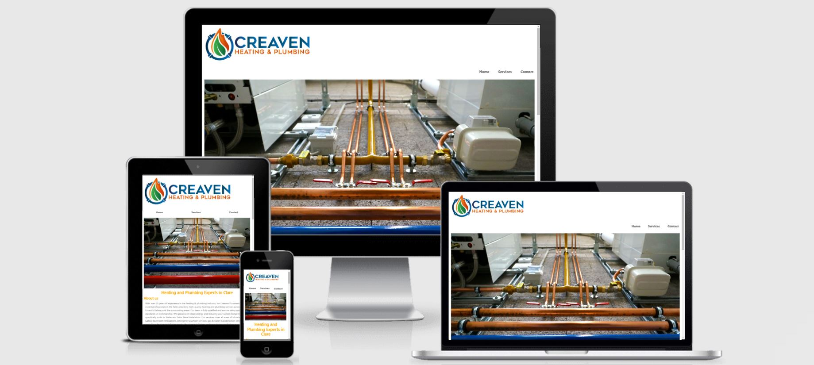
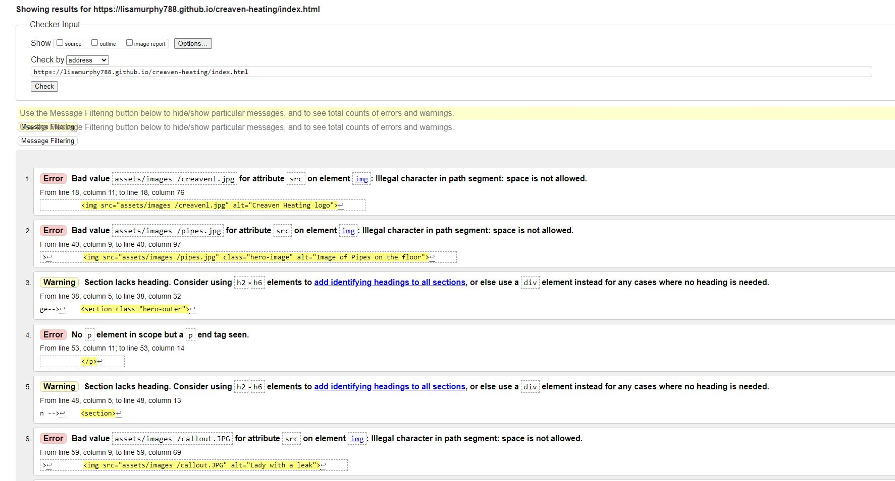
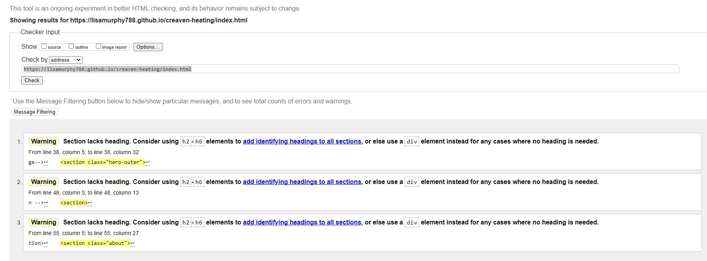
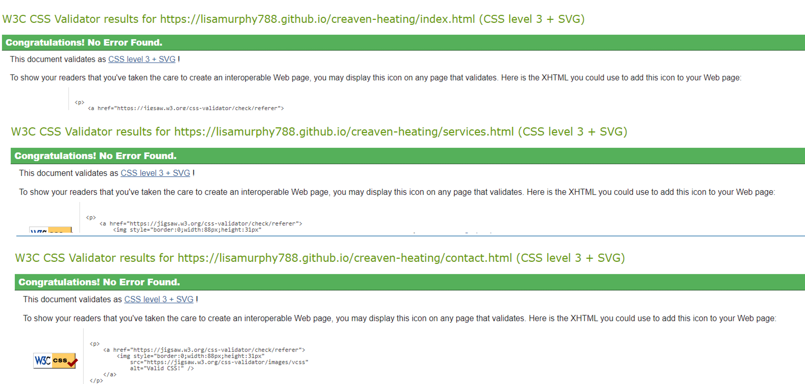

# Creaven Heating and Plumbing

 
 * [UX](#ux)
    + [Project Goals](#project-goals)
    + [User Stories](#user-stories)
      - [Site User](#site-user)
      - [Site Owner](#site-owner)
    + [Design Choices](#design-choices)
      - [Typography](#typography)
      - [Colors](#colors)
      - [Images](#images)
    + [Wireframes](#wireframes)
  * [Features](#features)
    + [Existing Features](#existing-features)
      - [**The header and footer**](#--the-header-and-footer--)
      - [**The Header Includes**](#--the-header-includes--)
      - [**The Footer Includes**](#--the-footer-includes--)
      - [**The Homepage**](#--the-homepage--)
      - [**The about page**](#--the-about-page--)
    + [**How it works page**](#--how-it-works-page--)
      - [Top section - How it works](#top-section---how-it-works)
      - [Bottom Image and bottom section - How it works](#bottom-image-and-bottom-section---how-it-works)
    + [**FAQ page**](#--faq-page--)
    + [**Contact**](#--contact--)
    + [**Thank you page**](#--thank-you-page--)
    + [Future Features](#future-features)
  * [Testing](#testing)
  * [Deployment](#deployment)
  * [Credits](#credits)
    + [Content](#content)
    + [Media](#media)
    + [Acknowledgments](#acknowledgments)
  

 Creaven Heating and plumbing is a informative website used for providing people with information on newer more GREENER ways to consume energy for heating your home. They also provide other services such as call outs and emergency work. 

 You can visit the deployed site here [here](https://lisamurphy788.github.io/creaven-heating/index.html)
 ### User Stories 
#### Site User
- As a user of this site, I want to find out information on what air to water is.
- As a user of this site, I want to know I want to be able to submit a contact form. 
- As a user of this site, I want to know if the service provides for emergencys. 
- As a user of this site, I want to be able to use this website fully from my mobile.
- As a user of this site, I want to know what areas are covered.
- As a user of this site, I want links to social media so I can check for any issues with past customers or ask any questions. 
#### Site Owner
- As a site owner, I want the customer journey to be as seamless as possible. 
- As a site owner, I want to make sure the user finds the website and they find it informative and understand the process. 
- As a site owner, I want the customer to be able to contact me via contact form. 

 ### Design Choices
 #### Typography
- I used railway for my fonts from Google fonts as i felt it was clear, relaxed, and read very well. 
- I also used san-serif as a fallback in the event of the font not being supported. 

 #### Colors
- The main color throughout the website was Orange and White. 

Color Palate

#### Images
- I was supplied the logo.  
- All of the images used were in line with the theme of clean air and save the planet.  
- Any icons I used were taken from fontawesome. 
- List of images:
1. **Hero image** - used on the homepage. Image of pipes being fitted. 
2. **Services Hero Image** - image of clean river and blue sky 
3. **Contact hero image** includes a picture of of the earth with Grass growing on it. 
 ### Features
 ### Existing Features
 #### **The header and footer**
 - Are both present throughout all the pages. 
 - Have the same background color throughout. 

 #### **The Header Includes**
 - The logo and the nav bar outlining the options for Home, Services and Contact. The logo when clicked on any page will take you back to the home page. 

 #### **The Footer Includes**
 - Social media links

 #### **The Homepage**
 The homepage/landing page includes an image that has some animation. It zooms slightly on landing. Also provides some information on services covered. You can get to the contact page from all pages also through a contact us. 

 #### **Services Page**
 Provides information on the services provided.  
 ### **Future Features**
 - Include maps and phone numbers.
 - Once the form has been submitted the user should get a confirmation email or confirmation. 
 - Hamburger menu for mobile and tablet
 - Reviews carosel. 
  ## Main Technologies Used
- [Github](https://github.com/) Used for hosting the project
- [Gitpod](https://gitpod.io) Used for developing the website 
- [HTML](https://en.wikipedia.org/wiki/HTML5) Used to provide content and structure
- [CSS](https://www.w3schools.com/css/) Used to provide styling
- [Am I Responsive](http://ami.responsivedesign.is/) Used to show visual responsiveness
- [Free Formatter](https://www.freeformatter.com) Used to clean up HTML and CSS 
- [Googe Fonts](https://fonts.google.com/) Used for main fonts listed
- [Font Awesome](https://fontawesome.com/v5.15/icons?d=gallery&p=2) Used for icons for social media 
- [Google Chrome Screen Reader Extension](https://chrome.google.com/webstore/detail/screen-reader/kgejglhpjiefppelpmljglcjbhoiplfn?hl=en) Used to test screen reading
- [Bootstrap](https://getbootstrap.com/) Used for contact form and contact us
- [W3C Validator](https://validator.w3.org/) Used for testing HTML 
- [Jigsaw CSS validator](https://jigsaw.w3.org/css-validator/)

## Testing
### HTML testing
A number of errors and warnings appeared first when testing. However all the errors where fixed. 

Once testing was finished the only issues that were outstanding where the below. 

## Code Validator testing 

### CSS testing 
No errors where found 

 ## Deployment
 **To deploy the project**

This project is hosted in GitHub Pages

1. On the menu on the top of the project’s repository on GitHub select **Settings**.
2. Scroll down to the GitHub **Pages** section.
3. Inside that section, click on the drop-down menu under **Source** and select **Master Branch**.
4. The page refreshes automatically and the website is now deployed.
5. The link to the webpage is just in the GitHub **Pages** section down below.

Only one branch has been used for this project.

To clone this project from GitHub:

1. Under the repository’s name, click Clone or download.
2. In the Clone hTTPS section, copy the URL.
3. In your IDE, open **Git Bash**.
4. Change directory to the location where you want the cloned directory to be made.
5. Type **git clone**, and then paste the URL copied from GitHub.
6. Press **enter** and the local clone will be created.

 ## Credits 
 ### Content 
Most of the text from SEAI information on their website on cleaner energy and also from the owner of the site. 

Some code was adapted from what was thought in the Love Running project. Examples of this can be seen in the;

- Website animation
- Footer with social media links 
Some of the nav bar was adpapted from 
[Dev website](https://dev.to/jungjungie/create-a-navbar-with-css-flexbox-2leh)

For getting a better understanding of displaying divs I watched the following video's:  
[coder-coder](https://coder-coder.com/display-divs-side-by-side/) 

For getting a better understanding of contact forms i watched the following video
[How to build a responsive form with flexbox](https://webdesign.tutsplus.com/tutorials/building-responsive-forms-with-flexbox--cms-26767)

To get a better understanding of Flexbox I used CSS tricks  [A guide to Flexbox](https://css-tricks.com/snippets/css/a-guide-to-flexbox/ )

In order to gain a better understanding of HTML and CSS I watched the following channels that provided tutorials on both aspects some examples of these can be seen below;

- Kevin Powell [Flexbox](https://www.youtube.com/watch?v=hwbqquXww-U&list=PL4-IK0AVhVjMSb9c06AjRlTpvxL3otpUd) 

- Kevin Powell [How to create a nav bar](https://www.youtube.com/watch?v=FEmysQARWFU)

- Web Dev Simplified [Learn flexbox in 15 min](https://www.youtube.com/watch?v=fYq5PXgSsbE)
- Taversy Media [CSS crash course for absolute beginners](https://www.youtube.com/watch?v=yfoY53QXEnI&t=1307s)
- Taversy Media [How to build a responsive website](https://www.youtube.com/watch?v=p0bGHP-PXD4)
- Dev Ed [Learn flexbox in 20 min](https://www.youtube.com/watch?v=FTlczfR82mQ)
- Dev Dreamer [Complete guide to flexbox](https://www.youtube.com/watch?v=-DNLYk5uzl8)
- Keep Coding [5 CSS tricks all web developers should know](https://www.youtube.com/watch?v=wfaDzSL6ll0)
- Code Series [Faq section design](https://www.youtube.com/watch?v=yaRPsq6qDMk)

- GFree code camp [How to cread a html button link](https://www.freecodecamp.org/news/how-to-create-an-html-button-that-acts-like-a-link/)

### Media
All of the pictures that i have on this site are taken from [Pixels](https://www.pexels.com/) and 
[Free Images](https://www.freeimages.com/vector/grass-covered-earth-5186478) 

All of the icons for this website have been taken from [Fontawesome](https://fontawesome.com/v5.15/icons?d=gallery&p=2)

The fonts used in this website was used from [Google fonts](https://fonts.google.com/)

I used Freeformater to run my HTML through for cleaning and indentation. [Free Formatter](https://www.freeformatter.com/)

### Acknowledgments
I would like to thank my mentor Brian for all his support and guidance. 
My family for all the testing on all the different devices. 
My cohort who are a great support. 
